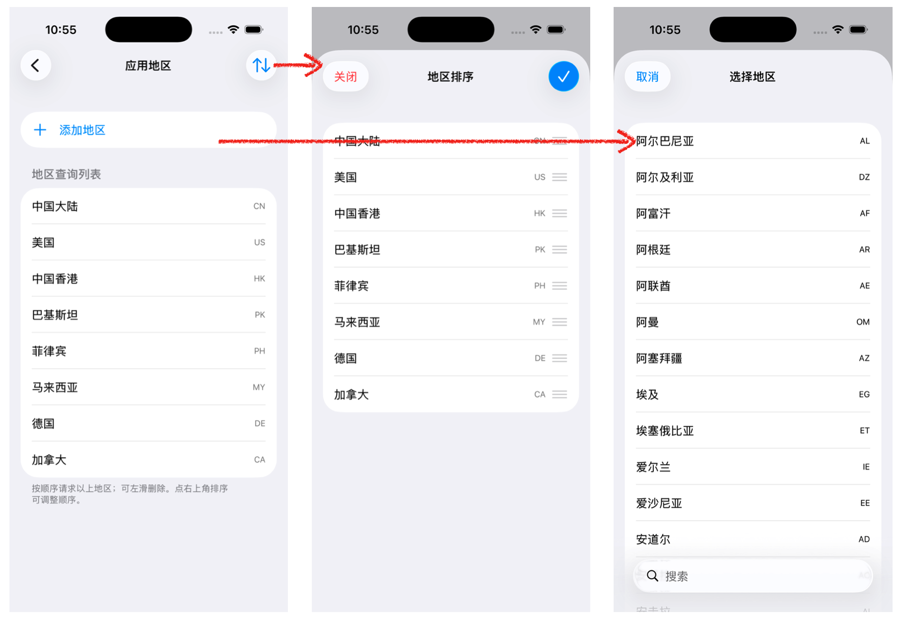
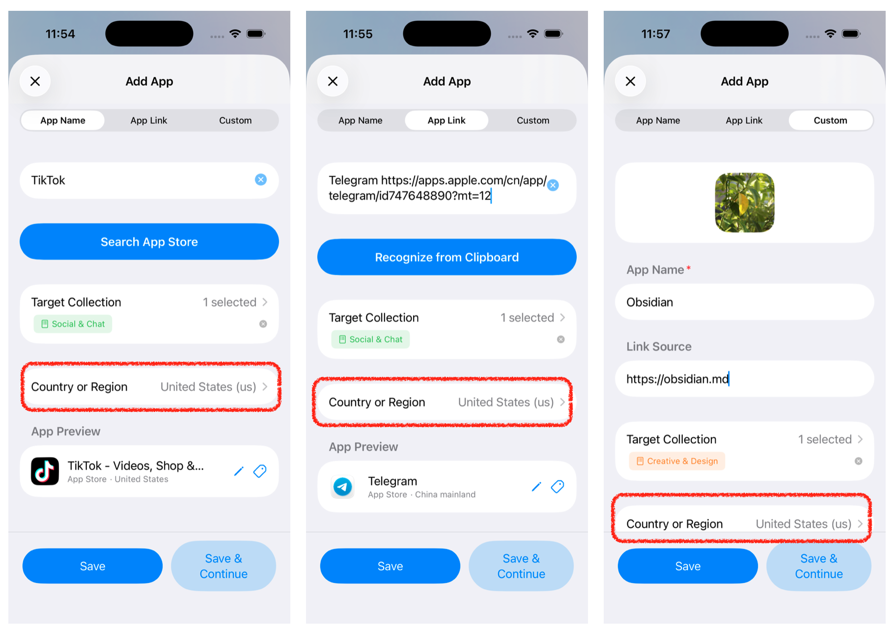
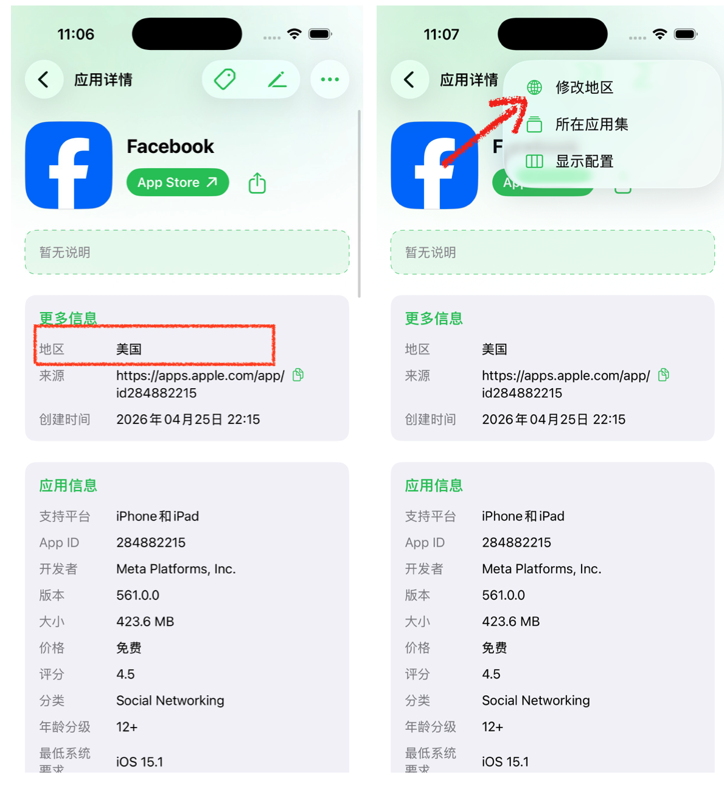
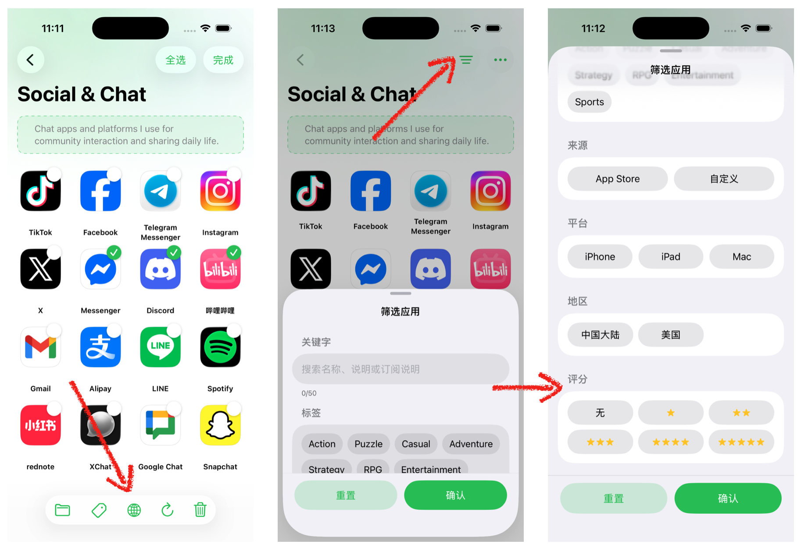

# How App Regions Work
**App Region** refers to: which country's or region's App Store AppBox uses when **querying app information such as descriptions and icons**.

It helps you:

**Find apps available in that region**, **display names and icons based on that region**, and **perform unified region queries in batches**.

:::info
**Note:** Availability, translated names, and other information are determined by the App Store of the selected region. If an app is reported as unavailable in that region, this is a result returned by the store itself and does not mean your collection has been lost.

:::

## When You Might Use It
+ **Cannot find an app by name** → Switch to another region and search again (some apps are only available in specific stores).  
+ **Apps with identical names are hard to distinguish** → Use regions to differentiate displayed information.  
+ **The link already contains a region** → AppBox will **prioritize identifying the region from the link** (see below).  
+ **Multi-country app lists** → Use **Filter · Region** to view them, or **batch modify regions** and refresh afterward.

## Managing App Regions in “Settings”
**Settings → Apps → App Region**

<!-- 这是一张图片，ocr 内容为： -->

This is the **“Region Query List”**: the enabled countries or regions. The **top-to-bottom order** represents priority (higher items are queried first; this order is also referenced when multiple regions are attempted).

| Action | Description |
| --- | --- |
| **Add Region** | Tap “Add Region” and choose from the directory. You can add **up to 10 regions**; a prompt will appear when the limit is reached. |
| **Delete** | **Swipe left** on a row to delete it. At least **1 region must remain**. |
| **Sort** | Tap **Sort** in the top-right corner, drag items into position, then tap **Done** to save. The **topmost** region is generally used as the default priority (especially when the region cannot be inferred from a link). |
| **List Empty** | The page will prompt you to select regions through “Add Region”. |

### Difference from the “Select Region” List
In places such as **Add App** and **App Details**, the popup **“Select Region”** list generally only shows the regions that you have already enabled in Settings (that is, the “Region Query List” above), making quick switching more convenient.

The **Add Region** option in Settings, on the other hand, lets you choose from the **full region directory** in order to expand the enabled list.

## App Store Links and Regions: Recognition Rules
When you paste or share an **App Store app link**, AppBox will try to read the **country or region** from the link itself. For example:

+ If the link contains something like `…/cn/app/…` or `…/us/app/…` — usually **two lowercase letters** — it will generally be recognized as the corresponding region (for example, cn → Mainland China storefront, us → United States storefront).

| Situation | What Happens |
| --- | --- |
| **The region can be identified from the link** | In **Add App → App Link**, the “Country or Region” row will usually **not appear** (because the region has already been specified by the link). Changing the region list order in Settings **does not override** this link-priority behavior. |
| **The region cannot be identified from the link** | A **“Country or Region”** option will appear (for example, “Mainland China (cn)”), using the current selection maintained in your Settings. |
| **Pasting multiple links at once** | If the entire text block **cannot** be parsed as a single region-specific link, the “Country or Region” option will usually **be displayed**. Multiple links will **share** the region strategy selected this time. |

**In short:** If the link clearly specifies a region, AppBox follows the link. If not, AppBox follows the region selected in your settings.

## Specifying a Region When Adding an App
<!-- 这是一张图片，ocr 内容为： -->

## Viewing and Modifying Regions in the App Details Page
<!-- 这是一张图片，ocr 内容为： -->

### Viewing the Region
Open **“More Information”** in the app details page. One of the rows, **“Region”**, displays the storefront name corresponding to the current store code for this saved app.

### Modifying the Region (Store-Sourced Apps Only)
1. In the **“⋯”** menu at the top-right corner of the app details page, tap **“Modify Region”**.  
2. Select any item in **“Select Region”** and confirm.  
3. AppBox will **re-query the App Store** to check whether the app exists in the newly selected region.  
    - **Success:** The app name, icon, and other information will be updated (if provided by the store), and a **Modification Successful** message will appear.  
    - **Failure:** For example, if the app is unavailable in the selected store and the message **“This app is not available in the selected region’s App Store”** appears, the region will automatically **revert to the previous value** to avoid leaving invalid data.

> **Custom Apps** currently do not display the **“Modify Region”** option because their information is manually provided by you.
>

## Managing App Regions Within an App Collection
<!-- 这是一张图片，ocr 内容为： -->

### Batch Modify Regions
When you have **multiple store-sourced apps selected** within the **same app collection**, you can switch them to the same region at once and attempt to refresh their displayed information.

#### Steps
1. Open an **App Collection**.  
2. Tap the **“⋯”** button in the top-right corner → **“Select Apps”**.  
3. Select multiple apps.  
4. Tap **“Region”** (globe icon) in the bottom toolbar.  
5. Choose the target region in **“Select Region”**. The app will attempt to retrieve store information one by one.  
6. After completion, you can view the **“Batch Region Modification Results”** page, where successful, failed, or skipped apps are listed separately.

### Filtering (Show Only Specific Regions)
In the app collection details page, tap the **Filter** icon in the top-right corner → form field **“Region”** → select multiple regions to display only matching apps in the current collection. The selectable regions are limited to the regions that actually appear within the current collection.

## “Apple Data” in Data Import
**Settings → Data Import → Apple Data** allows you to select 1–10 regions before starting the import. App information will be retrieved automatically according to the order of the list until a match is found or all strategies are exhausted.

Note that selecting too many regions will significantly slow down the import process. It is recommended to select only 1–3 regions.

